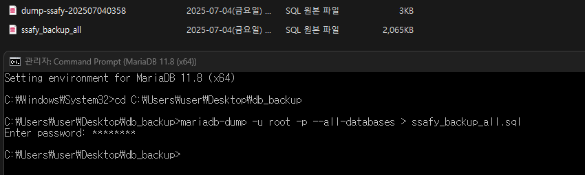
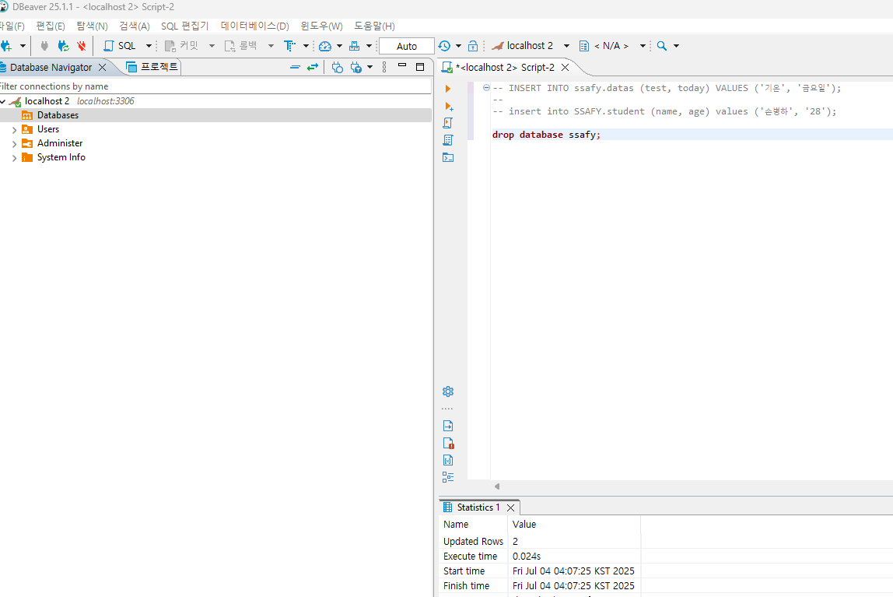
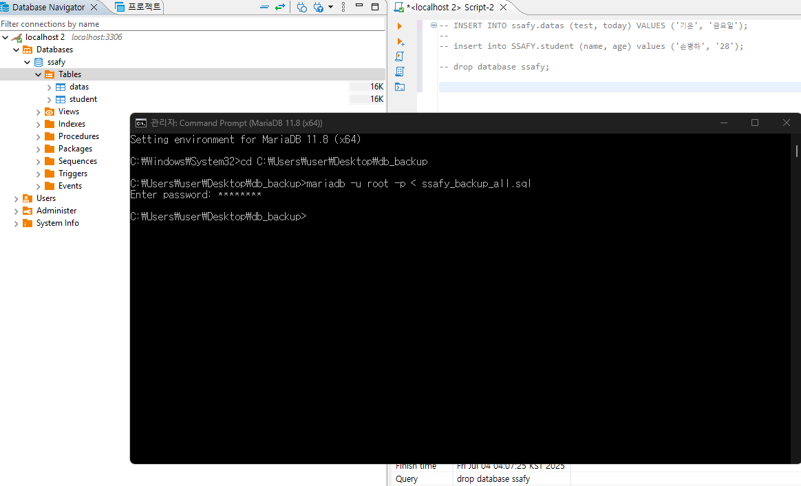
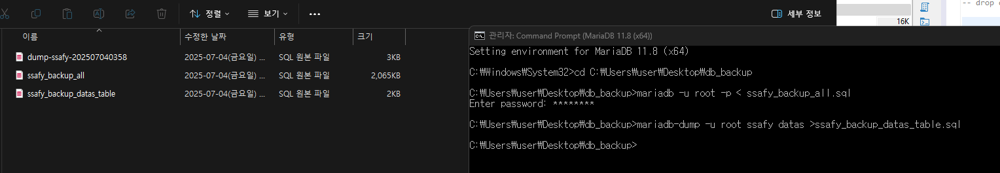
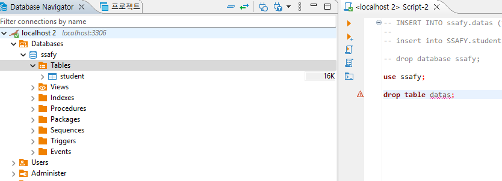
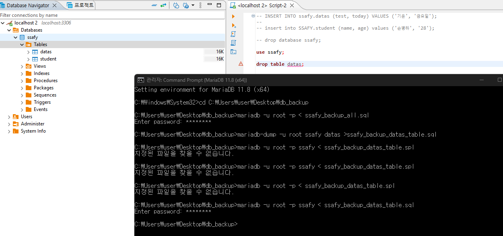
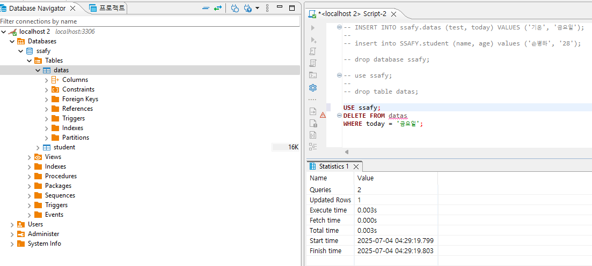
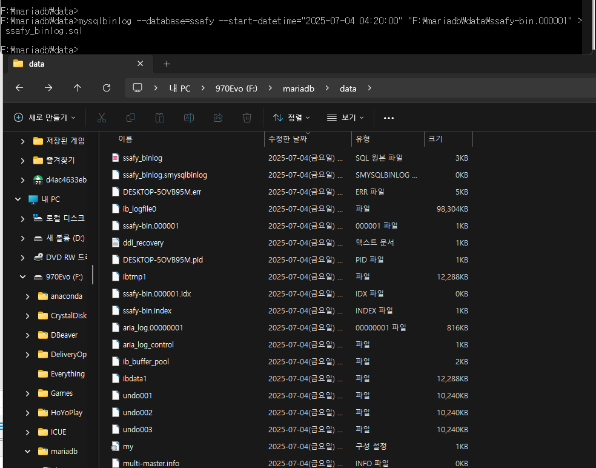

# MariaDB 백업 및 복구 작업 정리

이 문서는 MariaDB에서 수행한 백업 및 복구 작업을 유형별로 정리한 것입니다. 전체 데이터베이스 백업, 특정 테이블 백업, 바이너리 로그를 이용한 작업을 단계별로 기록합니다.

---

## 📦 1. Database Full Backup

### ✅ 백업 명령어
```bash
mariadb-dump -u root -p --all-databases > ssafy_backup_all.sql
```

- 전체 데이터베이스(`--all-databases`)를 SQL 파일로 백업
- 출력 파일: `ssafy_backup_all.sql`

📎 관련 스크린샷:





### ✅ 복구 명령어
```bash
mariadb -u root -p < ssafy_backup_all.sql
```

---

## 📂 2. 특정 테이블(`datas`) 백업 및 복구

### ✅ 백업 명령어
```bash
mariadb-dump -u root ssafy datas > ssafy_backup_datas_table.sql
```

- `ssafy` 데이터베이스 내 `datas` 테이블만 백업

📎 관련 스크린샷:





### ✅ 복구 명령어
```bash
mariadb -u root -p ssafy < ssafy_backup_datas_table.sql
```

> ⚠️ 오타 경로(`.spl`) 입력 시 실패 → `.sql`로 재입력하여 복구 완료

---

## 🧾 3. Binary Log 추출

### ✅ 추출 명령어
```bash
mysqlbinlog --database=ssafy --start-datetime="2025-07-04 04:20:00" "F:\mariadb\data\ssafy-bin.000001" > ssafy_binlog.sql
```

- `ssafy` 데이터베이스의 바이너리 로그 중 지정된 시간 이후의 로그를 추출
- 출력 파일: `ssafy_binlog.sql`

📎 관련 스크린샷:




---

## 💬 참고 사항

- 전체 백업은 정기적으로 수행할 것
- 테이블 단위 백업은 테스트 시 유용
- 바이너리 로그는 복원보다는 **변경 이력 추적용**으로 적합
- 복구 명령 실행 전 대상 DB/테이블 존재 여부를 반드시 확인할 것

---

🗂 백업 파일 목록:
- `ssafy_backup_all.sql`
- `ssafy_backup_datas_table.sql`
- `ssafy_binlog.sql`
